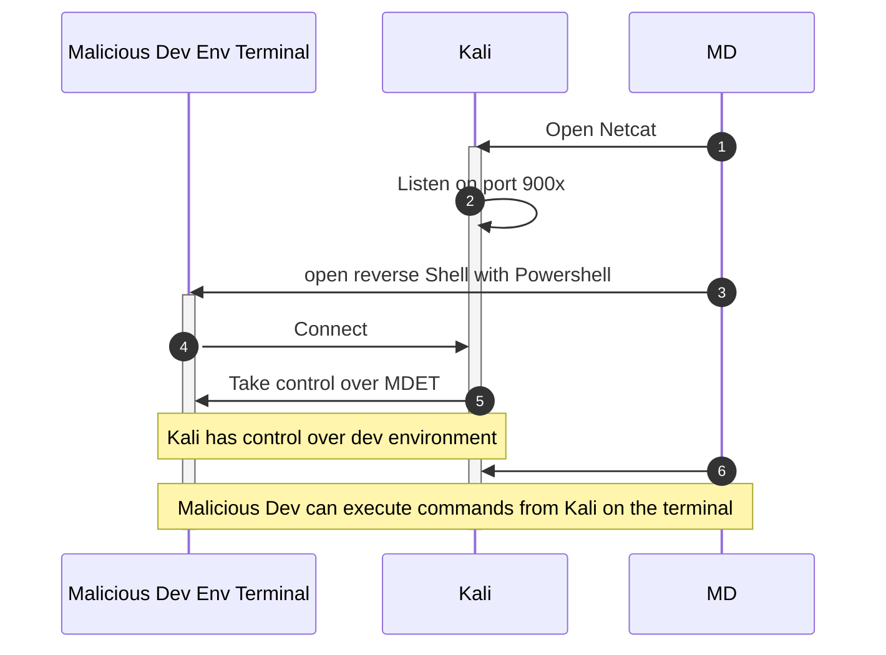

# Reverse Shell 101

```mermaid
sequenceDiagram        
    participant MDET as Malicious Dev Env Terminal
    participant K as Kali            
    autonumber

    MD ->> K: Open Netcat    
    activate  K
        K ->> K: Listen on port 900x        
        MD ->> MDET: open reverse Shell with Powershell
        activate MDET
            MDET ->> K: Connect
            K ->> MDET: Take control over MDET
            note over K, MDET: Kali has control over dev environment
            MD ->> K: 
            note over MD, MDET: Malicious Dev can execute commands from Kali on the terminal
        deactivate MDET
    deactivate K
```
