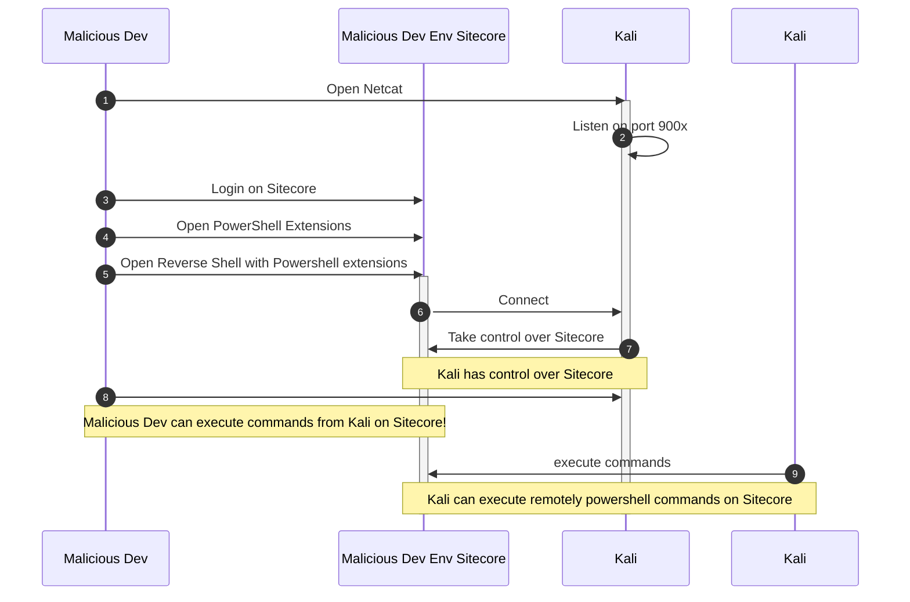

# Reverse Shell on own machine

```mermaid
sequenceDiagram
    participant MD as Malicious Dev
    participant MDES as Malicious Dev Env Sitecore    
    participant K as Kali                
    autonumber

    MD ->> K: Open Netcat    
    activate  K
        K ->> K: Listen on port 900x        
        MD ->> MDES: Login on Sitecore
        MD ->> MDES: Open PowerShell Extensions
        MD ->> MDES: Open Reverse Shell with Powershell extensions
        activate MDES
            MDES ->> K: Connect
            K ->> MDES: Take control over Sitecore
            note over K, MDES: Kali has control over Sitecore
            MD ->> K: 
            note over MD, MDES: Malicious Dev can execute commands from Kali on Sitecore!
            Kali ->> MDES: execute commands
            note over Kali, MDES: Kali can execute remotely powershell commands on Sitecore
        deactivate MDES
    deactivate K
```