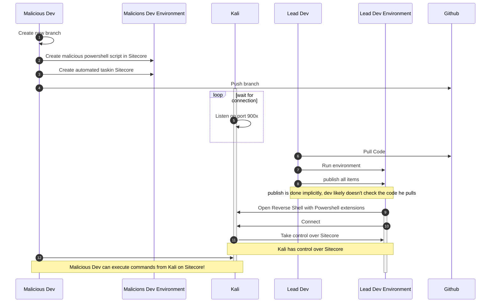

# Reverse Shell on Other Sitecore development machine

trick your Lead dev into setting up a reverse shell for you

```mermaid
sequenceDiagram
    participant MD as Malicious Dev    
    participant MDE as Malicions Dev Environment
    participant K as Kali      
    participant LD as Lead Dev    
    participant P as Lead Dev Environment
    participant G as Github                
    autonumber
    
    MD ->> MD: Create new branch
    MD ->> MDE: Create malicious powershell script in Sitecore
    MD ->> MDE: Create automated taskin Sitecore
    MD ->> G: Push branch    
    
    activate K    
        loop wait for connection
            K ->> K: Listen on port 900x  
        end
        LD ->> G: Pull Code
        LD ->> P: Run environment
        LD ->> P: publish all items
        note over LD, P: publish is done implicitly, dev likely doesn't check the code he pulls                          
        P ->> K: Open Reverse Shell with Powershell extensions
        activate P
            P ->> K: Connect
            K ->> P: Take control over Sitecore
            note over K, P: Kali has control over Sitecore
            MD ->> K: 
            note over MD, K: Malicious Dev can execute commands from Kali on Sitecore!
        deactivate P
    deactivate K
```