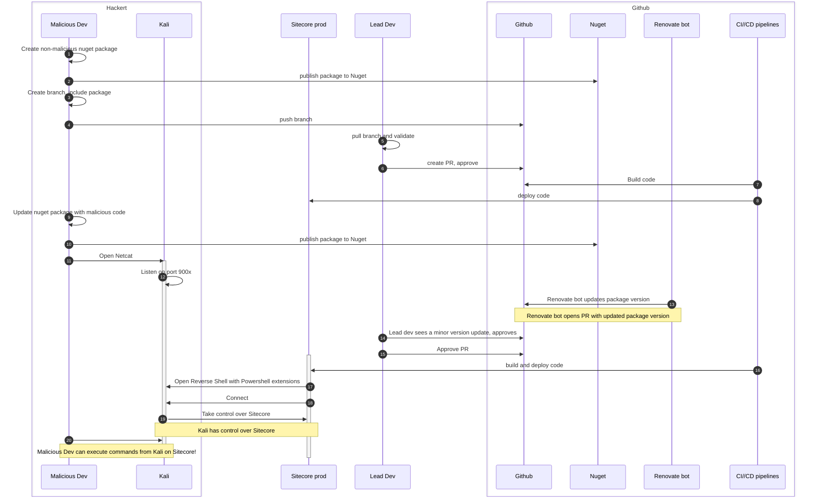

# Reverse Shell on production environment using nuget package upgrade

```mermaid
sequenceDiagram
    box Hackert
    participant MD as Malicious Dev
    participant K as Kali
    end
    participant P as Sitecore prod    
    participant LD as Lead Dev
    
    box Github
    participant G as Github  
    participant N as Nuget
    participant R as Renovate bot
    participant CICD as CI//CD pipelines    
    end

    autonumber

    MD ->> MD: Create non-malicious nuget package
    MD ->> N: publish package to Nuget
    MD ->> MD: Create branch, include package
    MD ->> G: push branch
    LD ->> LD: pull branch and validate
    LD ->> G: create PR, approve
    CICD ->> G: Build code
    CICD ->> P: deploy code    
    MD ->> MD: Update nuget package with malicious code
    MD ->> N: publish package to Nuget
    MD ->> K: Open Netcat         
    activate  K
        K ->> K: Listen on port 900x     
        R ->> G: Renovate bot updates package version
        note over R, G: Renovate bot opens PR with updated package version
        LD ->> G: Lead dev sees a minor version update, approves
        LD ->> G: Approve PR    
        activate P
            CICD ->> P: build and deploy code        
            P ->> K: Open Reverse Shell with Powershell extensions        
            P ->> K: Connect
            K ->> P: Take control over Sitecore
            note over K, P: Kali has control over Sitecore
            MD ->> K: 
            note over MD, K: Malicious Dev can execute commands from Kali on Sitecore!
        deactivate P
    deactivate K
```
